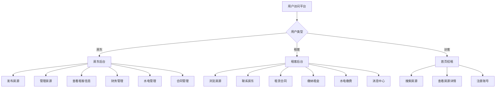
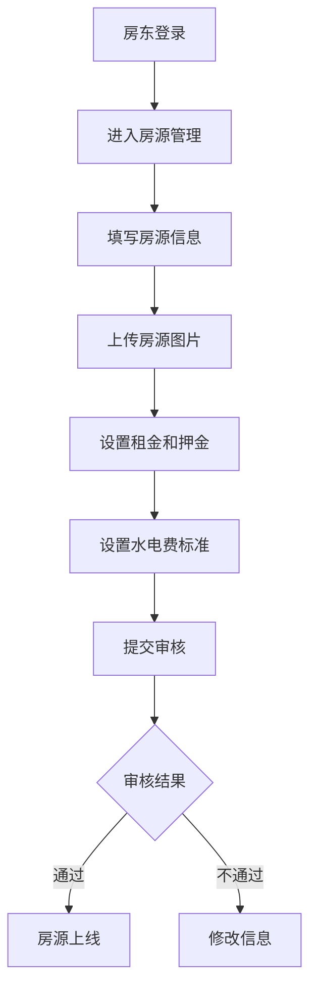
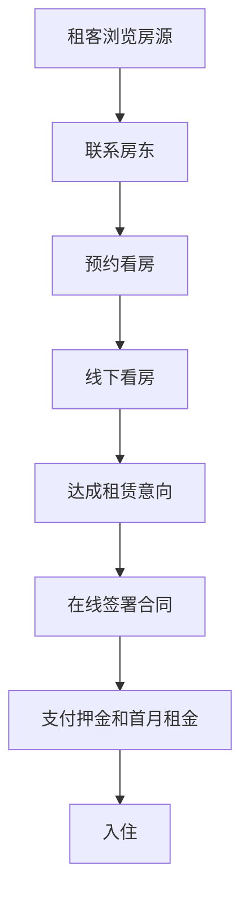
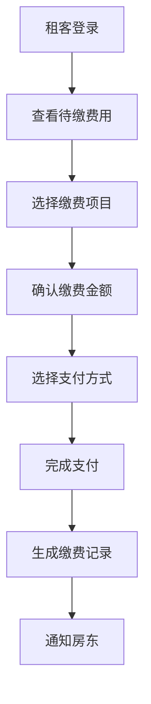

# 房屋出租管理平台方案

## 项目概述

本项目旨在开发一个房屋出租管理平台网站，为房东和租客提供便捷的在线服务。平台将包含三个主要部分：首页招租页面、房东后台管理系统和租客后台管理系统。

## 功能模块

### 1. 首页招租页面

- **房源展示**：以列表或网格形式展示所有可租赁的房源信息
- **搜索功能**：按位置、价格、房型等条件筛选房源
- **房源详情**：点击房源可查看详细信息，包括图片、描述、价格、地理位置等
- **联系房东**：提供与房东联系的渠道
- **用户注册/登录**：访客可注册成为房东或租客

### 2. 房东后台管理系统

- **房源管理**
  - 添加新房源：录入房屋基本信息、上传图片、设置租金等
  - 编辑房源信息：修改房屋描述、价格、图片等
  - 删除房源：下架不再出租的房源
  - 房源状态管理：设置房源为可租、已租或暂停出租状态
  
- **租客管理**
  - 查看已租房源的租客信息
  - 与租客沟通记录
  
- **财务管理**
  - 查看租金收入记录
  - 查看租客付款状态
  - 生成财务报表
  
- **水电管理**
  - 设置房源水电费标准
  - 录入每月水电表读数
  - 生成水电费账单
  - 查看水电费缴纳情况
  
- **合同管理**
  - 创建和管理租赁合同
  - 合同到期提醒

### 3. 租客后台管理系统

- **房源查看**
  - 查看自己租赁的房源信息
  - 查看房源详细信息和历史记录
  
- **租金缴纳**
  - 在线缴纳房租
  - 查看缴费历史记录
  - 缴费提醒功能
  
- **水电管理**
  - 查看每月水电表读数
  - 查看水电费账单
  - 在线缴纳水电费
  - 查看水电费缴费历史
  
- **合同查看**
  - 查看当前租赁合同
  - 查看合同历史
  
- **消息中心**
  - 与房东沟通
  - 接收系统通知和提醒

## 系统流程图

### 用户访问流程

### 房源发布流程

### 租房流程

### 租金缴纳流程

## 技术架构建议

- **前端**：React.js 或 Vue.js
- **后端**：Node.js (Express) 或 Python (Django/Flask)
- **数据库**：MySQL 或 MongoDB
- **用户认证**：JWT 或 Session
- **部署**：Docker + Nginx

## 数据模型设计

### 用户表 (Users)
- 用户ID
- 用户名
- 密码
- 邮箱
- 手机号
- 用户类型 (房东/租客)
- 注册时间

### 房源表 (Properties)
- 房源ID
- 房东ID
- 标题
- 描述
- 地址
- 房型
- 面积
- 价格
- 状态
- 创建时间
- 更新时间

### 租赁合同表 (Contracts)
- 合同ID
- 房源ID
- 房东ID
- 租客ID
- 开始日期
- 结束日期
- 月租金
- 押金
- 合同状态
- 创建时间

### 财务记录表 (FinancialRecords)
- 记录ID
- 合同ID
- 缴费人ID
- 金额
- 缴费时间
- 缴费状态
- 交易号

### 水电费标准表 (UtilityRates)
- 标准ID
- 房源ID
- 水费单价
- 电费单价
- 创建时间
- 更新时间

### 水电费记录表 (UtilityRecords)
- 记录ID
- 合同ID
- 水表读数
- 电费读数
- 记录月份
- 应缴水费
- 应缴电费
- 总金额
- 缴费状态
- 创建时间

## 安全考虑

- 用户密码加密存储
- 敏感操作需要身份验证
- 防止SQL注入和XSS攻击
- 文件上传安全检查
- HTTPS加密传输

## 项目开发计划

1. **需求分析与设计** (1周)
2. **数据库设计与搭建** (1周)
3. **后端API开发** (2周)
4. **前端页面开发** (2周)
5. **测试与优化** (1周)
6. **部署上线** (0.5周)

## 预期成果

- 完整的房屋出租管理平台
- 用户友好的界面设计
- 安全可靠的数据管理
- 完善的房东和租客功能
- 可扩展的系统架构